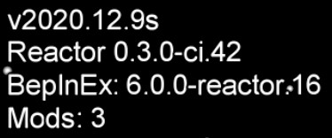

# Installing BepInEx and Reactor

# Table of Contents
- [Locating the Among Us game files directory](#locating-the-among-us-game-files-directory)
- [Installing BepInEx](#installing-bepinex)
- [Installing Reactor](#installing-reactor)

## Locating the Among Us game files directory

On steam, this can be achieved by right clicking Among Us in the steam
library then selecting `Manage > Browse local files`.

## Installing BepInEx

<table>
    <thead>
        <tr>
            <td>UwU Version</td>
            <td>BepInEx version</td>
        </tr>
    </thead>
    <tbody>
        <tr>
            <td>2.0.0-pre.1</td>
            <td rowspan="3"><a href="https://github.com/NuclearPowered/BepInEx/releases/tag/6.0.0-reactor.18%2Bstructfix">6.0.0-reactor.18+structfix</a></td>
        </tr>
        <tr>
            <td>1.0.0</td>
        </tr>
        <tr>
            <td>0.1.0</td>
        </tr>
    </tbody>
</table>

1. Download the appropriate release from the above table.
2. Unzip the files into the Among Us game files directory. It should 
   look something like this after you add BepInEx:
   
```
.
├── Among Us_Data
├── Among Us.exe
├── BepInEx
│   ├── core/
│   └── unity-libs/
├── changelog.txt
├── doorstop_config.ini
├── GameAssembly.dll
├── mono
│   ├── Managed/
│   └── MonoBleedingEdge/
├── UnityCrashHandler32.exe
├── UnityPlayer.dll
└── winhttp.dll
```

3. Launch the game so that BepInEx can generate the necessary files, 
   then close the game after. The Among Us game files should now look 
   something like this:
   
```
.
├── Among Us_Data
├── Among Us.exe
├── BepInEx
│   ├── cache/
│   ├── config/
│   ├── core/
│   ├── patchers/
│   ├── plugins/
│   ├── unhollowed/
│   └── unity-libs/
├── changelog.txt
├── doorstop_config.ini
├── GameAssembly.dll
├── mono
│   ├── Managed/
│   └── MonoBleedingEdge/
├── UnityCrashHandler32.exe
├── UnityPlayer.dll
└── winhttp.dll
```
   
## Installing Reactor

<table>
    <thead>
        <tr>
            <td>UwU Version</td>
            <td>Reactor version</td>
        </tr>
    </thead>
    <tbody>
        <tr>
            <td>2.0.0-pre.1</td>
            <td><a href="https://github.com/DaemonBeast/Reactor/releases/tag/2021.5.10s">Reactor-2021.5.10s</a></td>
        </tr>
        <tr>
            <td>1.0.0</td>
            <td rowspan="2"><a href="https://github.com/NuclearPowered/Reactor/actions/runs/827746360">Reactor-2021.4.14s</a></td>
        </tr>
        <tr>
            <td>0.1.0</td>
        </tr>
    </tbody>
</table>

1. Download Reactor from the appropriate page in the above table.
2. Move the `Reactor.dll` file to the
   `(Among Us game files)/BepInEx/plugins` folder.
3. Launch the game. The top left of the game menu should look
   something like this:
   
