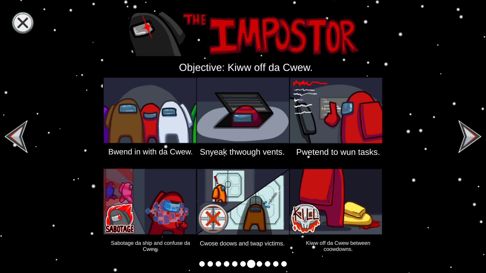
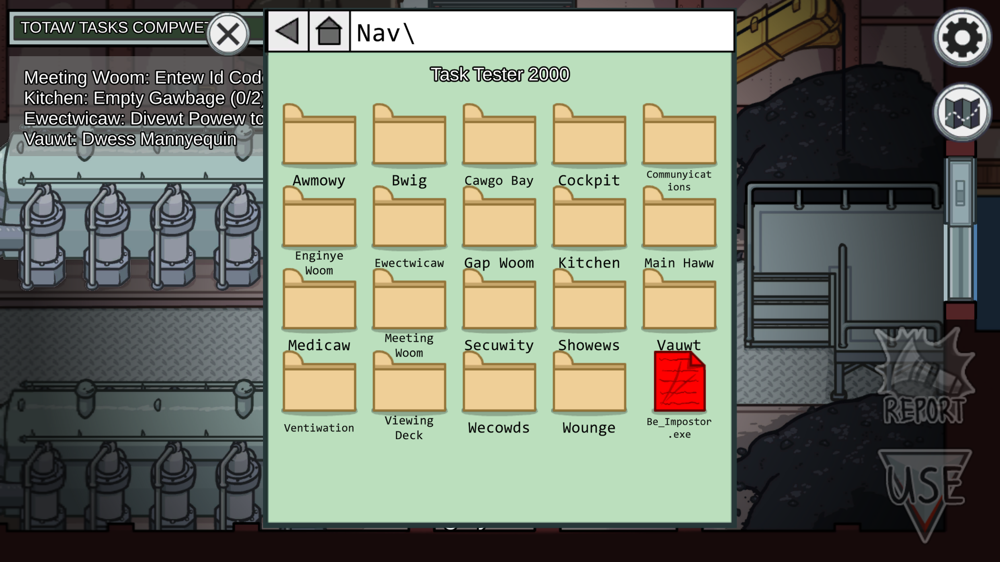

> **⚠ WARNING**
>
> The latest release (2.0.0-pre.1) is currently slightly broken. I
> am working to fix it.

# UwU

An Among Us mod to make Among Us UwU.

# Table of Contents
- [Hall Of Fame](#hall-of-fame)
- [Features](#features)
- [Installation](#installation)

## Hall Of Fame 🎉

- UwU conversion based on https://owoifier--black-is-back.repl.co.
- Inspired by the Twitter posts from
  [Sanae](https://twitter.com/AmongUsGame/status/1388217661658603524?s=20)
  and
  [Roobscoob](https://twitter.com/roobscoob1/status/1388011904900157441?s=20).
  The idea was originally theirs and I ~~stole~~ decided to take
  ~~their work~~ inspiration.

## Features

Modifies text to make it UwU.

## Installation

> **⚠ WARNING**
>
> This mod only has compiled releases for the steam release of the game.

1. Ensure that BepInEx and Reactor are installed ([installation guide](INSTALLATION.md)).
2. Download the appropriate mod on the [releases](https://github.com/MoltenMods/UwU/releases) page
   for the version of Among Us you are using (more info in below table).
3. Move the mod to the `(Among Us game files)/BepInEx/plugins` folder.
4. Launch the game.

<table>
    <thead>
        <tr>
            <td>UwU Version</td>
            <td>Among Us version</td>
            <td>BepInEx version</td>
            <td>Reactor version</td>
        </tr>
    </thead>
    <tbody>
        <tr>
            <td>2.0.0-pre.1</td>
            <td>2021.5.10s</td>
            <td rowspan="3"><a href="https://github.com/NuclearPowered/BepInEx/releases/tag/6.0.0-reactor.18%2Bstructfix">6.0.0-reactor.18+structfix</a></td>
            <td><a href="https://github.com/DaemonBeast/Reactor/releases/tag/2021.5.10s">Reactor-2021.5.10s</a></td>
        </tr>
        <tr>
            <td>1.0.0</td>
            <td rowspan="2">2021.4.12s - 2021.4.14s</td>
            <td rowspan="2"><a href="https://github.com/NuclearPowered/Reactor/actions/runs/827746360">Reactor-2021.4.14s</a></td>
        </tr>
        <tr>
            <td>0.1.0</td>
        </tr>
    </tbody>
</table>
